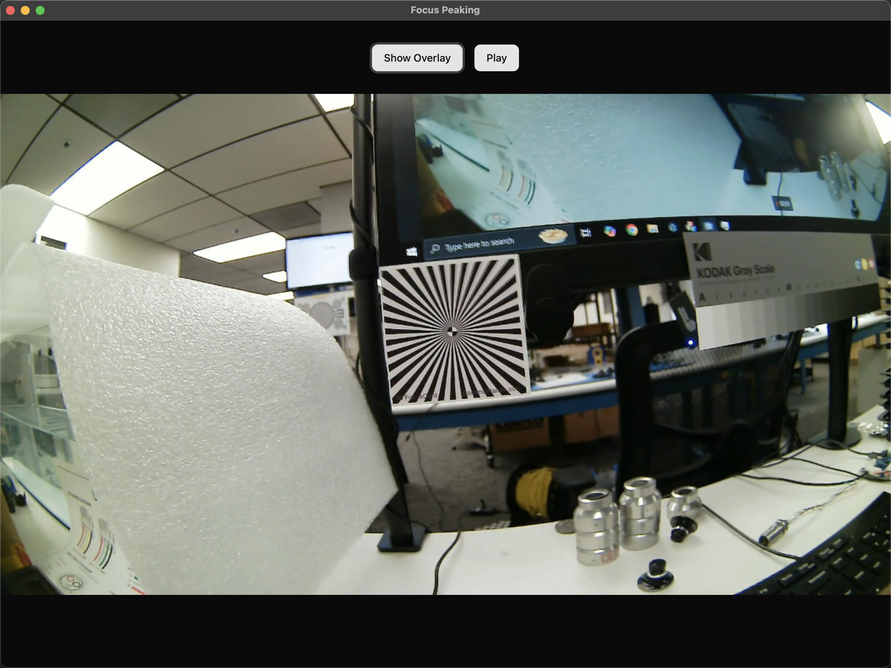

# Focus Peaking App

### Take Home Project for DeepWater Exploration Inc. by Joon Park

## Approach

This app was created with [electron-vite](https://electron-vite.org/), [Tailwind CSS](https://tailwindcss.com/), [shadcn/ui](https://ui.shadcn.com/), and a [focus-peaking algorithm from GreenpantsDeveloper](https://github.com/GreenpantsDeveloper/focus-peaking).

At installation, all dependencies are installed, and the video is processed with the focus peaking algorithm to produce the focus peaking overlay. When run.sh is executed, the Vite package is built, then the Electron app is built using the Vite generated files, and the resulting App will launch (Cross-platform compatible: Windows, MacOS, and Linux).




-   Front end: React/TypeScript/Vite
-   Back end: Python (algorithm runs and produces the focus peaking overlay video at installation).

## Instructions

To run this app, you must have Python 3 and Node.js installed on your system.

1. Clone this repository.

```bash
git clone https://github.com/jsp220/focus-peaking-app.git
cd focus-peaking-app
```

2. Make the installation script executable then run it.

```bash
chmod +x install.sh
./install.sh
```

3. Make the run script executable then run it.

```bash
chmod +x run.sh
./run.sh
```
